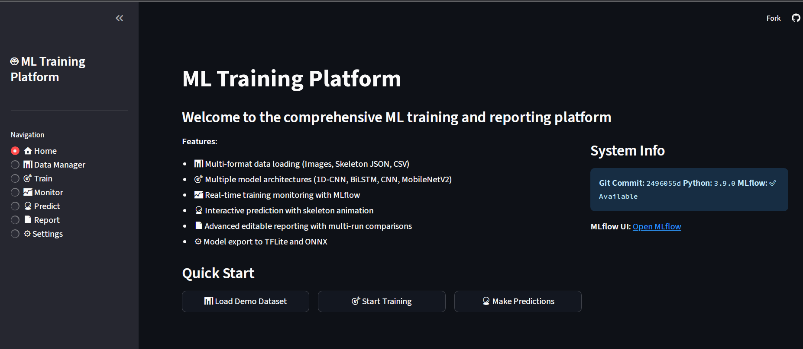

MIMICA ML Training Platform - by DEAR&CO   : https://dear.is-a.dev/

A comprehensive machine learning platform built with Streamlit for training, monitoring, and evaluating models for image, skeleton, and tabular data.
<p align="center">
  
</p>

<h1 align="center">ML Training Platform- MIMICA MLTP V1.3</h1>

A comprehensive machine learning platform built with Streamlit for training, monitoring, and evaluating models for image, skeleton, and tabular data.

<p align="center">
  
</p>


An easy guide for running analysis on local device without using the app can be found at- 
<p align="center">  
  https://github.com/kirokir/mtreport/edit/main/github/guide.html 
  </p>
  


---

##  Features

- **Multi-tab Interface**: Intuitive web UI for the complete ML workflow.
- **Versatile Data Loaders**: Supports images (PNG, JPG), skeleton JSON, and CSV/tabular data.
- **Multiple Model Architectures**: Includes CNNs, LSTMs, and MLPs for different data types.
- **Real-time Monitoring**: Track training progress with live-updating charts.
- **Advanced Reporting**: Generate detailed HTML and PDF reports with multi-run comparisons.
- **Model Export**: Supports exporting trained models to TensorFlow Lite and ONNX formats.

---

##  Getting Started: Running Locally

Follow these instructions to run the ML Training Platform on your own computer.

### Prerequisites

- **Python**: Version 3.11 or 3.12 recommended. You can download it from [python.org](https://www.python.org/).
- OR use the following code in VS code terminal
-  ```bash
   winget install Python.Python.3
   ```
   After Installation: Verify Your Version
Open a new terminal and run this command to confirm the installation was successful:
code
```bash
python3 --version
```
- **Git**: You need Git to clone the repository. You can download it from [git-scm.com](https://git-scm.com/).

### Installation & Setup

1.  **Clone the Repository:**
    Open a terminal or command prompt and run the following command:
    ```bash
    git clone https://github.com/kirokir/mtreport.git
    ```

2.  **Navigate to the Project Directory:**
    ```bash
    cd mtreport
    ```

3.  **Create a Virtual Environment (Recommended):**
    This isolates the project's dependencies from your system's Python.
    ```bash
    python -m venv venv
    ```

4.  **Activate the Virtual Environment:**
    - **On Windows:**
      ```bash
      .\venv\Scripts\activate
      ```
    - **On macOS / Linux:**
      ```bash
      source venv/bin/activate
      ```
    *You will know it's active when you see `(venv)` at the beginning of your terminal prompt.*

5.  **Install Dependencies:**
    This command installs all the necessary Python packages.
    ```bash
    python -m pip install .
    ```

    *Note: This installation may take several minutes as it needs to download large libraries like TensorFlow.*

6.  **Install System Dependencies (For Linux Users):**
    If you are on a Debian-based Linux distribution (like Ubuntu), you may need to install an additional system library for OpenCV to work correctly:
    ```bash
    sudo apt-get update && sudo apt-get install -y libgl1
    ```

### Running the Application

Once the installation is complete, you can start the Streamlit application with this command:

```bash
streamlit run app.py
```
Your web browser should automatically open with the application running.
📖 How to Use the Platform
Data Manager: Upload your datasets (images in a zip, skeleton JSONs, or a single CSV).
Train: Select your dataset and model, configure hyperparameters, and start the training process.
Monitor: View real-time loss and accuracy curves and see final metrics once training is complete.
Predict: Load a trained model and upload a new data sample to get a prediction.
Report: Generate and download detailed reports for single or multiple training runs.


